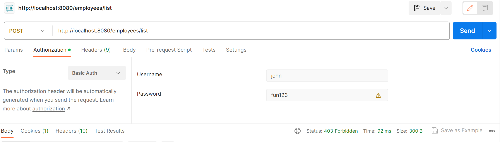

Spring Boot Spring MVC CRUD MYSQL Database Thymeleaf Poc Project

# Overview
The major functionality of this application is serving as an employees’ information management system. The application supports fully CRUD operations (Get/Add/Update/Delete) which enable clients to interact with the employee data seamlessly.  The front-end view is generated by ThymeLeaf template engine displayed as HTML files, while the backend development is using Spring MVC and Spring boot. 

# Project Structure
The application architecture is organized using multiple layers pattern which contains controller layer/service layer/(DAO)repository layers. The big picture would be: http requests come from client tools like web browser or postaman, go through the controller layer, service layer, repository layer in sequence, then hit the database, after the data is being accquired from database, it will be sent to the Thymeleaf template to render a view before sending back to the client side. 

## What I've done

- generate a springboot3 project using spring initializr, adding spring web/thymeleaf/dev tools denpendencies
- adding redirect functionality in the a index.html file so that http://localhost:8080 could be routed to the display page
- adding buttons for add which will href link /showFormForAdd, also inside controller class add@RequestMapping to handing this endpoint.For update a entry, set the employee as a model attribute to pre-populate the form. Adding @PostMapping to save any changes, also use redirection to prevent duplicate submissions.
- for deleting any entries, add a onclick alert as a confirmation message.
- the UI design is using bootstrap framework

## Sceenshots of CRUD operations

![update-one]](update-chandler.PNG)

![after-delete]](after-delete.PNG)

# Security Implementation
For security implementation I used spring security filters , which is the basic authentication. then I use postman for testing purpose.

The three roles for different identity as as login user are list below:

john-employee-viewall/

mary-manager-viewall/update

susan-admin-viewall/update/delete

# How to Run this Application
download or git clone the source code

USE Itellij to open this project

Menu -> Build -> Rebuild the Project

Open ThymeLeafdemoApplication.java, click run button

Goto localhost:8080/ to test all the endpoints and functionalities

#### reference https://luv2code.com/courses/

